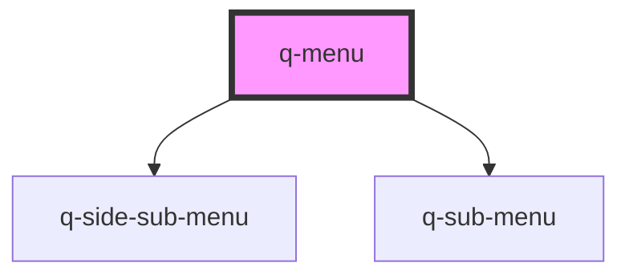

# app-menu

<!-- Auto Generated Below -->

## Properties

| Property        | Attribute         | Description | Type          | Default     |
| --------------- | ----------------- | ----------- | ------------- | ----------- |
| `closeMenuIcon` | `close-menu-icon` |             | `any`         | `undefined` |
| `imgPath`       | `img-path`        |             | `string`      | `undefined` |
| `menuItems`     | --                |             | `MenuItems[]` | `undefined` |
| `openMenuIcon`  | `open-menu-icon`  |             | `any`         | `undefined` |

## Dependencies

### Depends on

- [q-side-sub-menu](../q-side-sub-menu)
- [q-sub-menu](../q-sub-menu)

### Graph

----------------------------------------------

*Built with [StencilJS](https://stenciljs.com/)*
