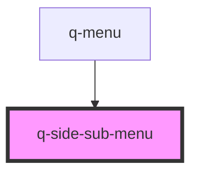

# app-side-sub-menu

<!-- Auto Generated Below -->

## Properties

| Property  | Attribute | Description | Type             | Default     |
| --------- | --------- | ----------- | ---------------- | ----------- |
| `subMenu` | --        |             | `SubMenuItems[]` | `undefined` |

## Events

| Event          | Description | Type               |
| -------------- | ----------- | ------------------ |
| `routeClicked` |             | `CustomEvent<any>` |

## Dependencies

### Used by

 - [q-menu](../q-menu)

### Graph

----------------------------------------------

*Built with [StencilJS](https://stenciljs.com/)*
